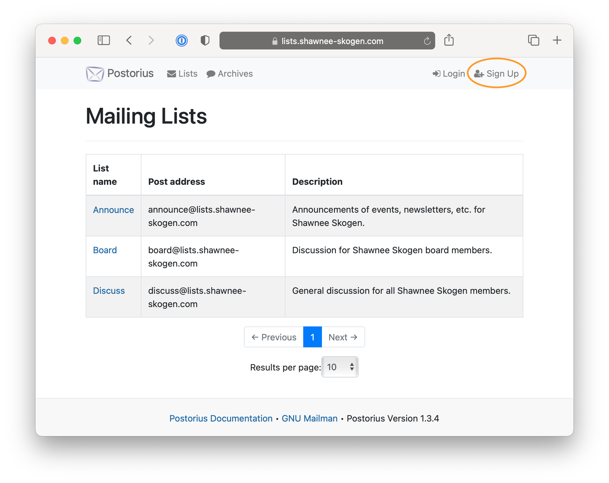
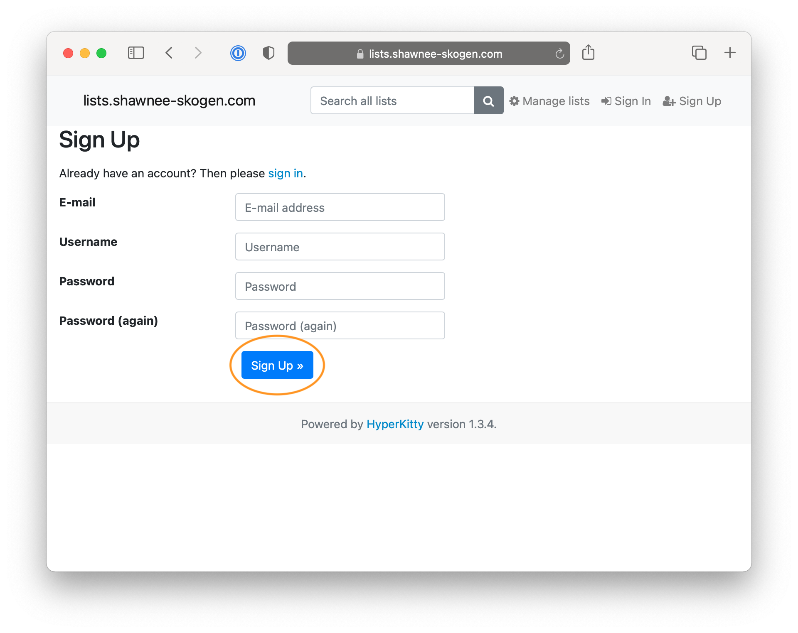
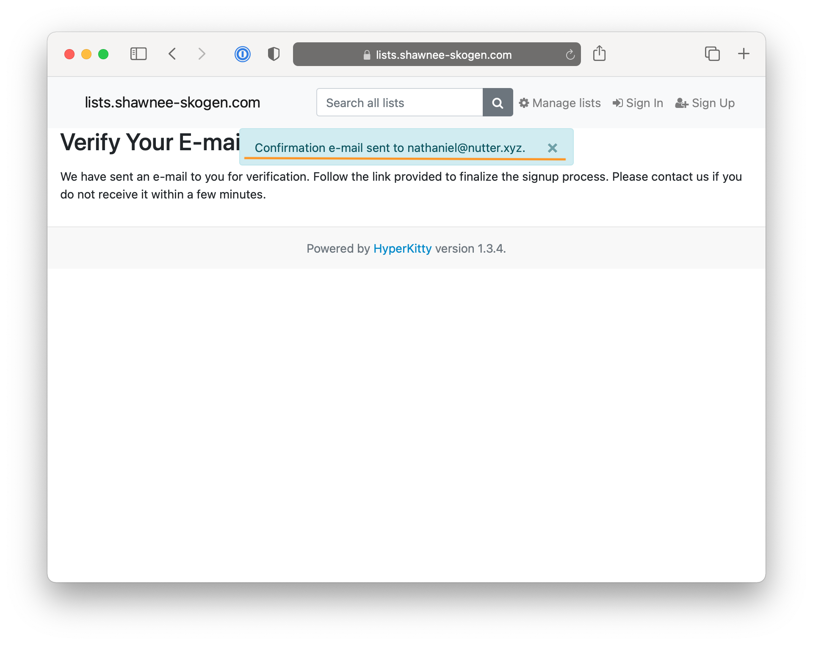
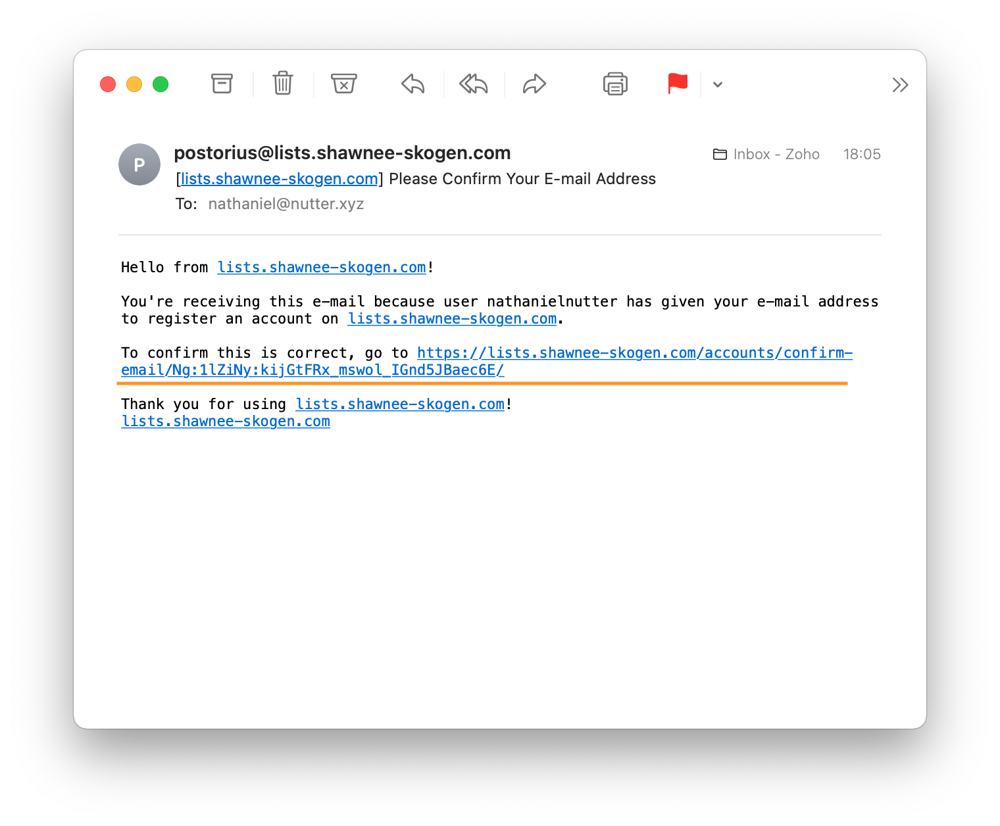
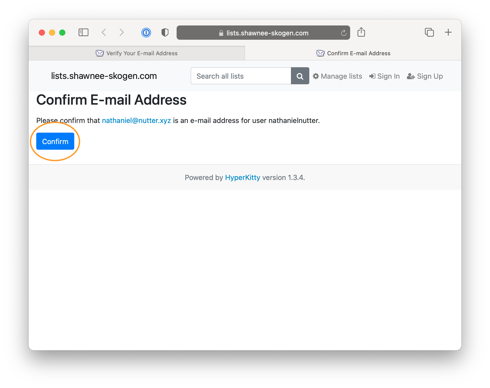
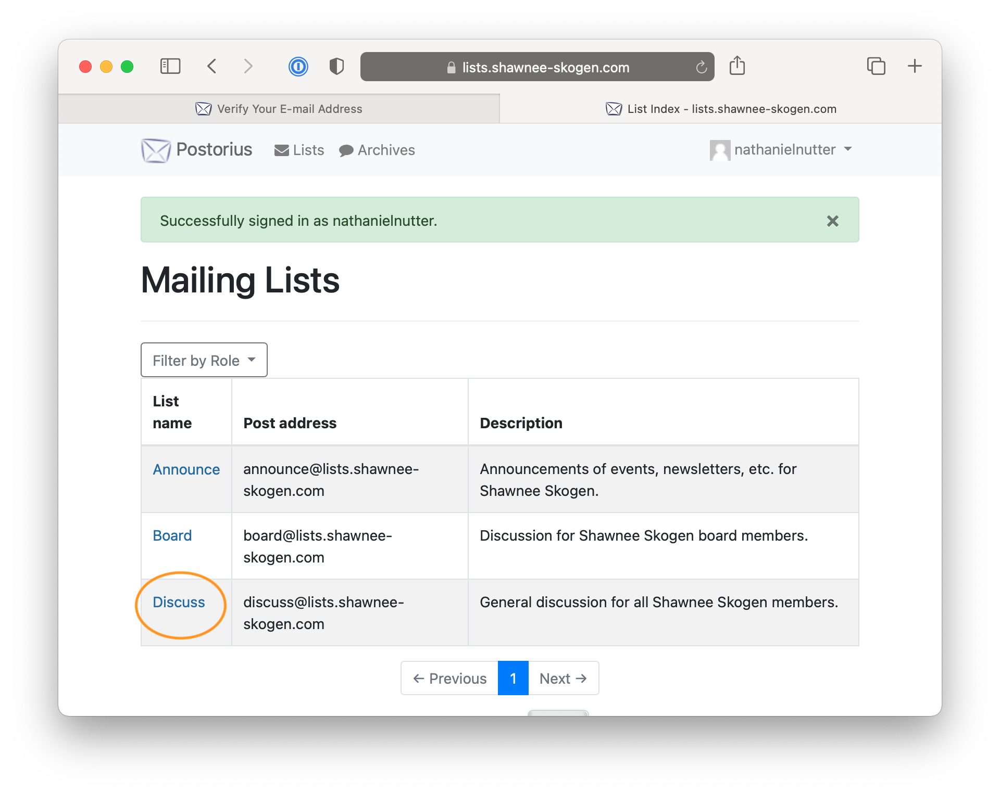
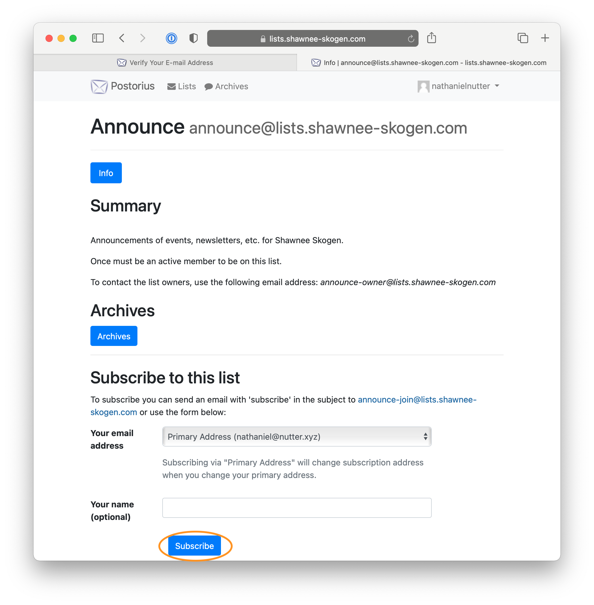
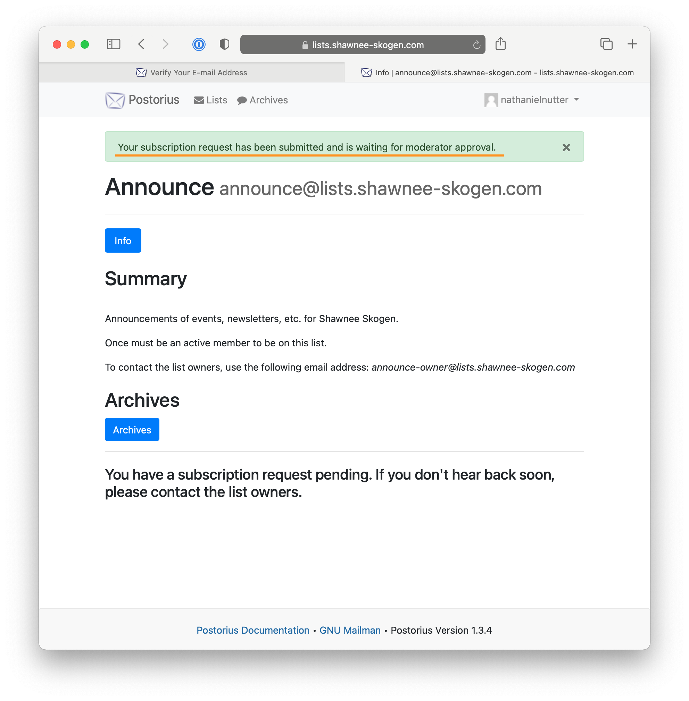
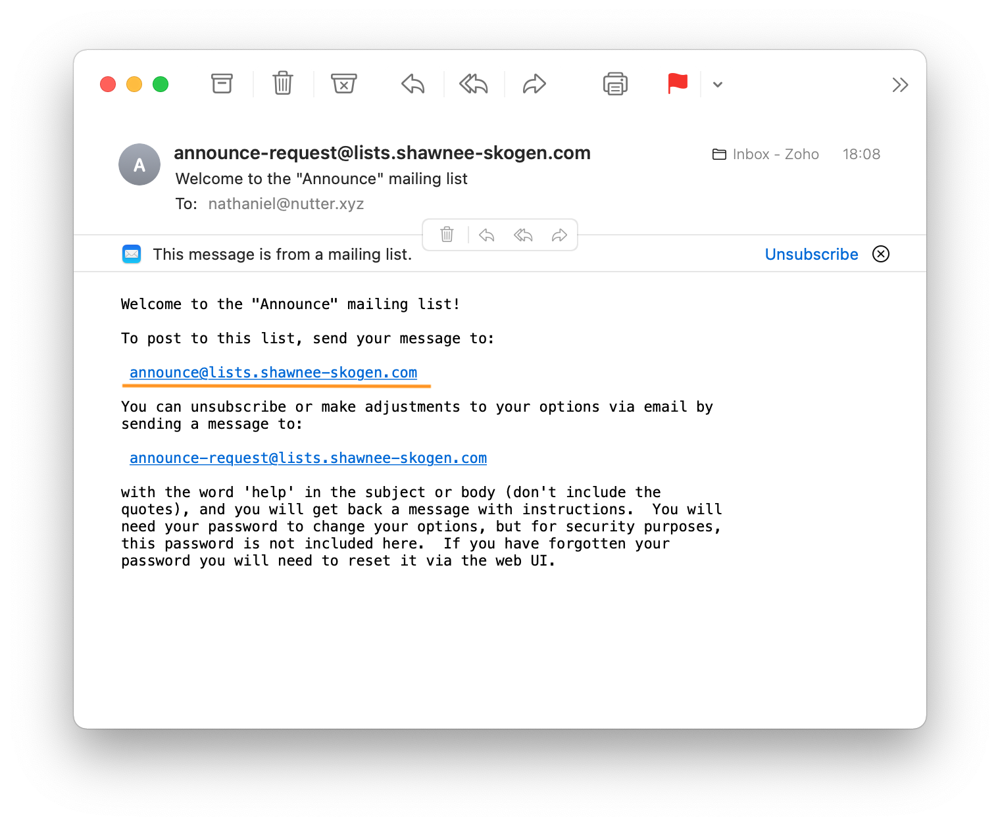

There are orange highlights on each screenshot to help draw your attention to relevant information or buttons.

## Create an account (once)

1. Go to [lists.shawnee-skokgen.com](https://lists.shawnee-skogen.com) and click on the "Sign Up" button,
    
2. Complete the form and then click on the "Sign Up" button,
    
3. You will then be notified that a verification email was sent to you,
    
4. Go to your email and find the verification email and click on the verification link,
    
5. Click the "Confirm" button,
    
6. You can then login with your email or username and your password.

## <a id="subscribe">Subscribe to a Mailing List (once per Mailing List)</a>

1. When you are [logged in](https://lists.shawnee-skogen.com/) you will see the list of Mailing Lists.  Click on the _List name_ for a Mailing List you wish to signup for,
    
2. Scroll down a bit to the section labels "Subscribe to this list" and click the "Subscribe" button,
    
3. You will then be notified that a moderator must approve your subscription,
    
4. Once approved you'll get an email welcoming you to the Mailing List and it will have the email address to use for the list,
    
5. You can then send new messages to that email address or reply to emails that others send to the Mailing List.
