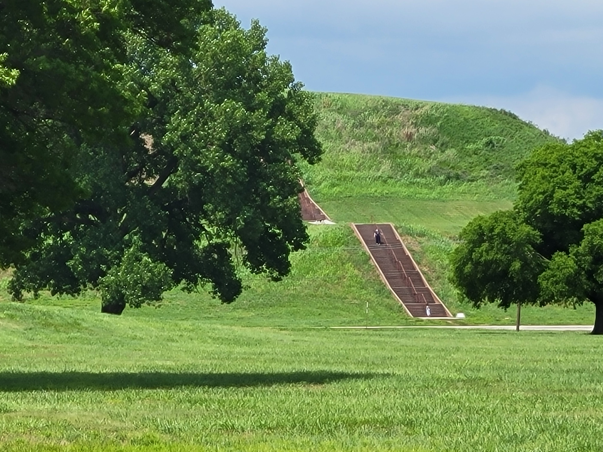

Eleven of us met up at the [Old Herald Brewery & Distillery](https://www.oldheraldbrewing.com) for lunch before heading over to the [Cahokia Mounds][1] ([Wikipedia][2]).
There we were joined by a few more members bringing us to sixteen in total.
It was wonderful to see everyone but in particular a couple members we haven't seen in a long time as well as several newer members for which this was their first or second in-person meeting.

We got to enjoy a special guided tour by Margarette, former site director and a French colonial archaeologist, who offered us a font of wisdom.
She introduced us to the Mississippian culture of this ancient city that existed around 1050-1350 CE.
We learned about the layout of the city, its defenses, the purposes of the mounds, etc.
Rolling in on the heels of our guided tour were some thunderstorms which prevented us from hiking up Monks Mound; until next time!

We finished off the guided tour and headed into the extremely welcoming, cooly air conditioned museum full of artifacts and exhibits.
Cahokia Mounds is a very interesting archaeological site that is well worth a stop if you are interested in the regions history.

Additional photos can be viewed on the [shared album](https://www.icloud.com/sharedalbum/#B0oGqkRUiGPWP6T).

Our next meeting is planned for August 22nd and will be in Centralia, IL where we will get to enjoy the sights of the [Centralia Balloon Fest][0].

_Photo by [Skubasteve834 - EN.Wikipedia, CC BY-SA 3.0](https://commons.wikimedia.org/w/index.php?curid=3019271)._

[0]: https://centraliachamber.com/balloon-fest
[1]: https://cahokiamounds.org
[2]: https://en.wikipedia.org/wiki/Cahokia
