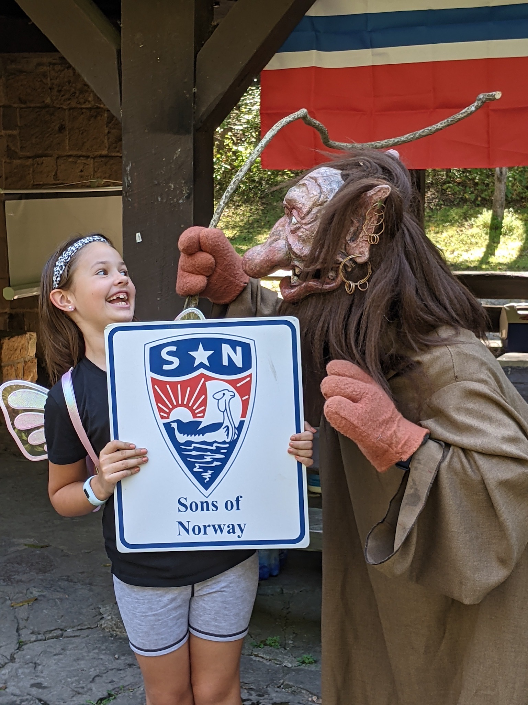

For September we met at Giant City State Park and the weather was absolutely sublime.
After taking care of the formal lodge meeting we continued on with a [presentation](royals.pdf) from Wendy about the state and relations of the royal families of Europe.

After the presentation we played a game of [Kubb](https://en.wikipedia.org/wiki/Kubb) which purports to be an ancient Viking game.
It was introduced to our lodge via [Nordic Fest](https://nordicfest.com) which sometimes hosts a Kubb tournament.
This photo only captures one team but the game was played 6 vs. 6,

If you would like to learn how to play check out this video,

<iframe width="560" height="315" src="https://www.youtube.com/embed/liMZ-dFMJSc" title="YouTube video player" frameborder="0" allow="accelerometer; autoplay; clipboard-write; encrypted-media; gyroscope; picture-in-picture" allowfullscreen></iframe>

Finally, Ron donned the troll costume so we could take some pictures for Viking magazine.

Additional photos can be viewed on the [shared album](https://www.icloud.com/sharedalbum/#B0o53qWtHXaibk).
