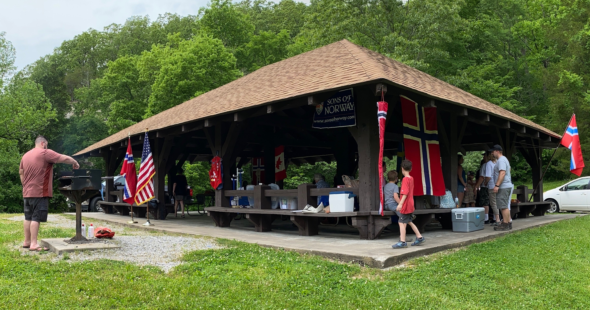
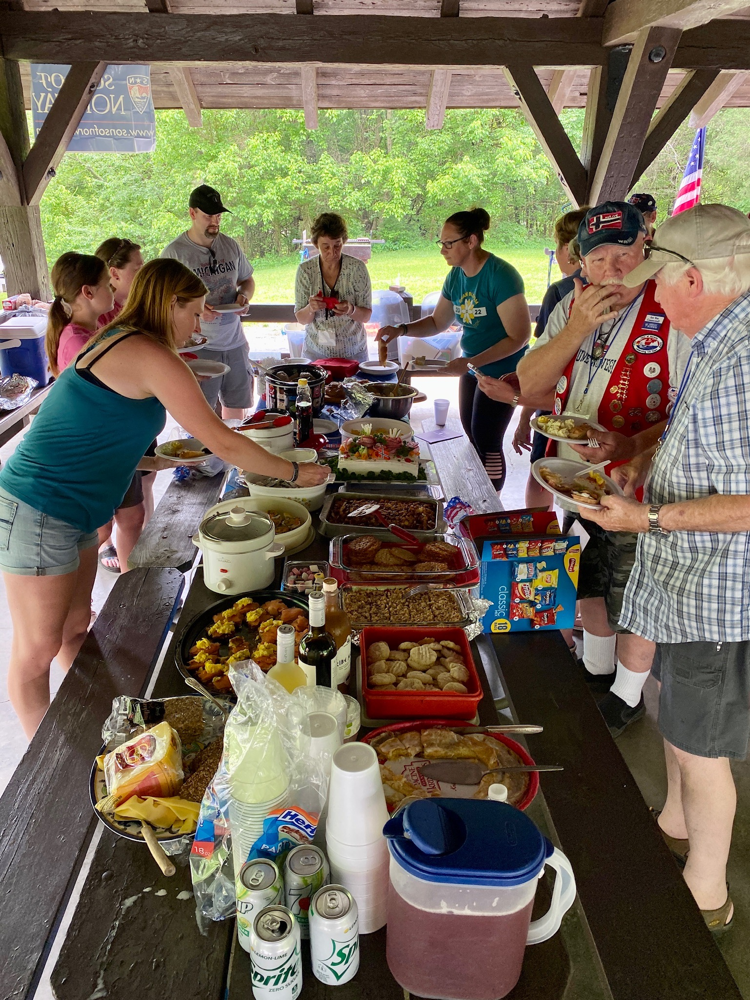
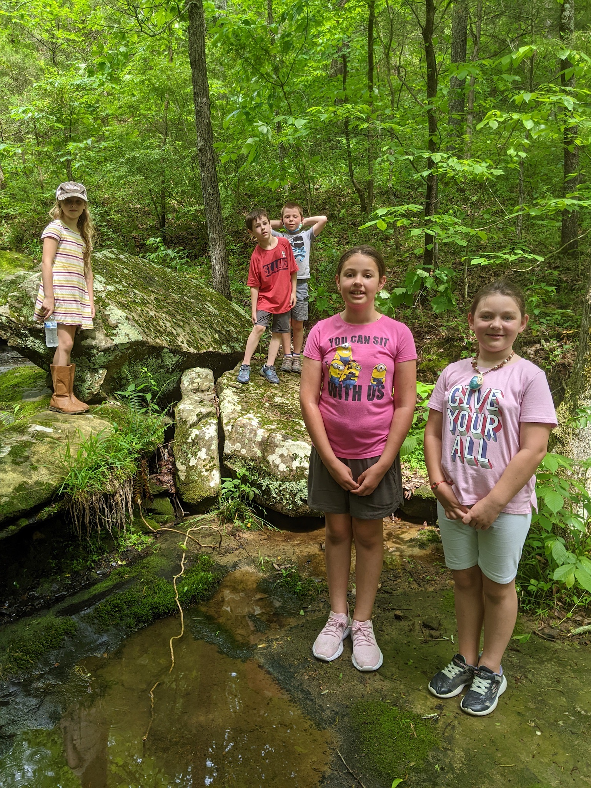

Gratulerer med dagen!
The weather gave us a reprieve and we were able to enjoy a wonderful picnic with many of our lodge members.
In Norwegian tradition, hot dogs were grilled and we attempted to serve ice cream.
There was a wonderful variety of dishes, some of which were made possible thanks to the Charmans' RV kitchenette.
We enjoyed seeing several lodge members we have not seen in a while!

The festivities took place at Giant City State Park where we had a nice shelter to give us some shade.
In addition to the meeting and potluck/picnic there was also some hiking, some baseball, and some Kubb.

Check out all the photos in our [2022 Syttende Mai](https://www.icloud.com/sharedalbum/#B0o5idkMw9vyCa) photo album.

If you have photos to share from the day please send them to [photos@shawnee-skogen.com](mailto:photos@shawnee-skogen.com?subject=2022%20Syttende%20Mai%20Photos).
