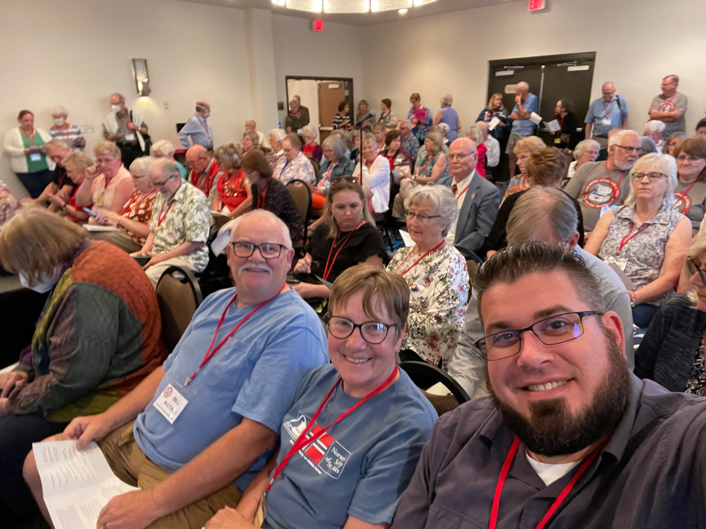
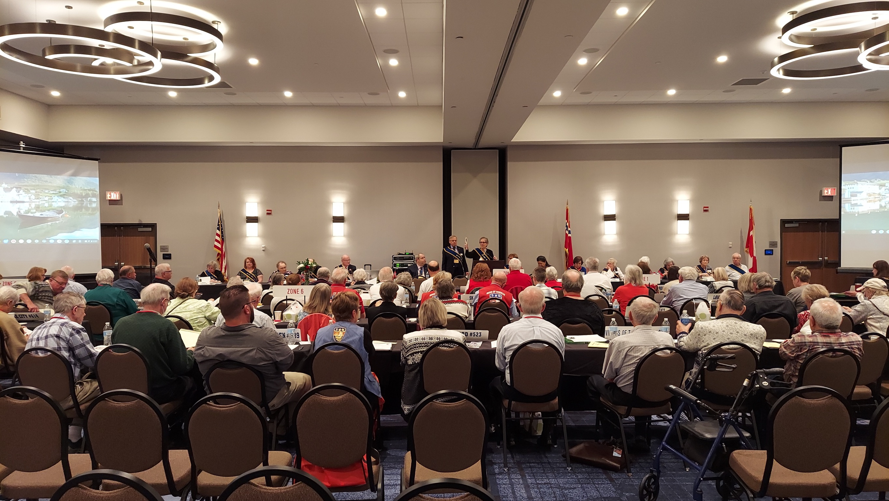
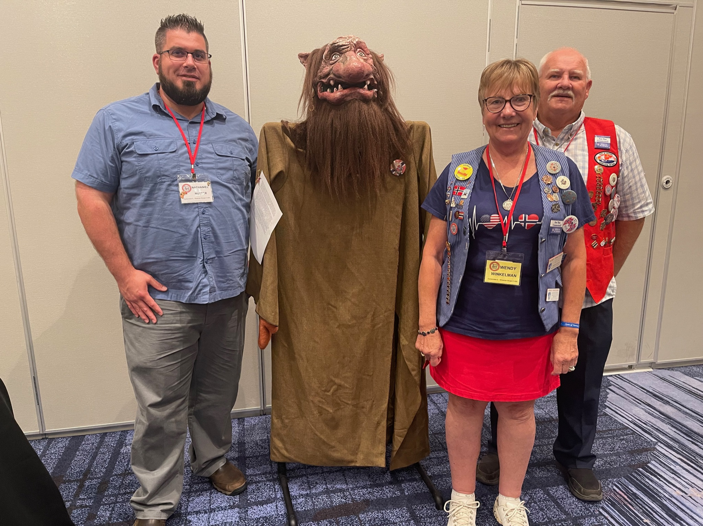

Wendy, Bill, and Nathan attended the 2022 District 5 Convention that took place June 15-19 in Middleton, WI.
We were there to represent our lodge by voting on any proposals and resolutions, to elect the district officers for the next biennium, and to elect our international delegates for the 2022 International Convention.

Coming out of the convention all three were also elected as district officers:

- Wendy is serving as the District 5 Vice President.
- Nathan is serving as the District 5 Treasurer.
- Bill and Wendy are both serving as Zone Directors.

Our lodge one two awards:

- 2019 Bronze Merit Award
- 2021 Silver Merit Award

Along with the business of the meeting there were also a room of cultural display, a few vendors selling nordic wares, classes on a number of topics, and evening activities involving music and dancing.

Be sure to check out all the photos in our [2022 District 5 Convention](https://www.icloud.com/sharedalbum/#B0oGFssfGGuj87W) photo album.
There is rosemaling, Hardanger embroidery, and more.
